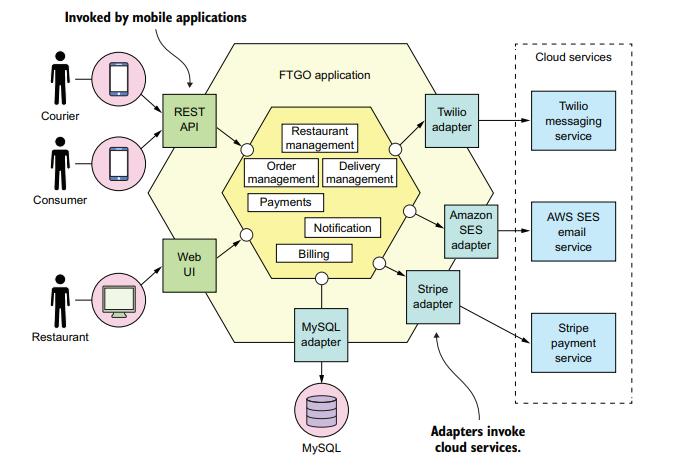

# ftgo
### Project description 
Consumers use the FTGO website or mobile application to place food orders at local restaurants. FTGO coordinates a network of couriers who deliver the orders. It’s also responsible for paying couriers and restaurants. Restaurants use the FTGO website to edit their menus and manage orders. The application uses various web services, including Stripe for payments, Twilio for messaging, and Amazon Simple Email Service (SES) for email.
### The monolith architecture
The FTGO application has a hexagonal architecture. It consists of business logic surrounded by adapters that implement UIs and interface with external systems, such as mobile applications and cloud services for payments, messaging, and email.

In the past, when the application was relatively small, the application’s monolithic architecture had lots of benefits. Over time, though, development, testing, deployment, and scaling became much more difficult because FTGO application has grown over the years into a monstrous monolith.
The large FTGO developer team commits their changes to a single source code repository. The path from code commit to production is long and arduous and involves manual testing. The FTGO application is large, complex, unreliable, and difficult to maintain.
### The microservice architecture
The backend services include the following:
- Order Service : Manages orders
- Delivery Service : Manages delivery of orders from restaurants to consumers
- Restaurant Service : Maintains information about restaurants
- Kitchen Service : Manages the preparation of orders
- Accounting Service : Handles billing and payments

This architecture consists of a set of loosely coupled services. Each team develops, tests, and deploys their services independently.

## Selected Components
We selected the `OrderController` class from the Order Service and `RestaurantController` from the Restaurant service as our chosen components to migrate to microservice architecture as this classes are not too trivial yet have the characteristics needed to become a service.
ther order controller service is supposed to manage the orders from the customers.
the restaurant controller service has the information about restaurants and their menus, prices, etc.
